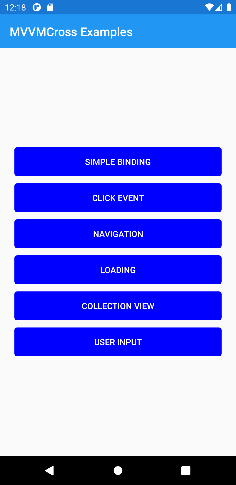
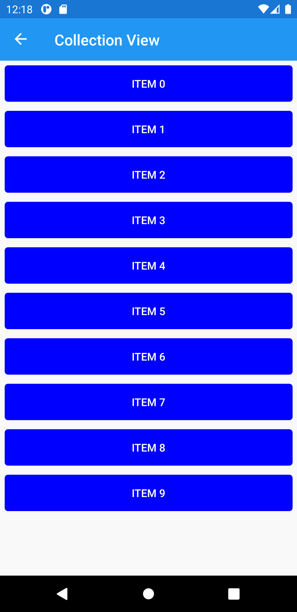
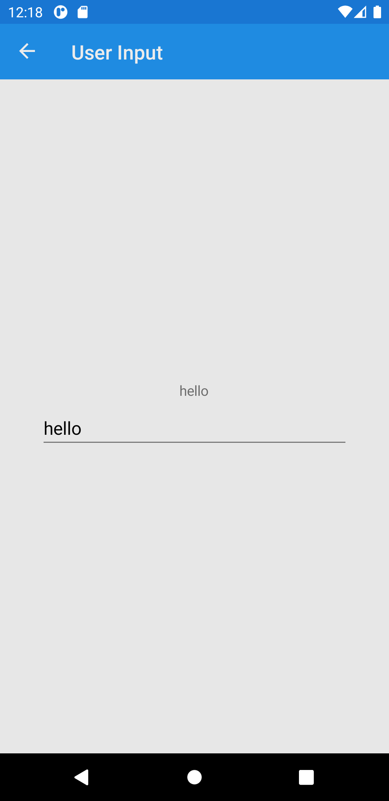

# HelloMvvmCross
MVVMCross sample project for beginners

## About MvvmCross
Build clean, pixel perfect, native UIs. Share behavior and business logic in a single codebase across supported platforms, using the Model-View-ViewModel (MVVM) design pattern. MvvmCross is a framework specifically developed for Xamarin and the mobile ecosystem. It supports Xamarin.iOS, Xamarin.Android, Xamarin.Mac, Xamarin.Forms, Universal Windows Platform (UWP) and Windows Presentation Framework (WPF)
## Offical documentation : [MvvmCross](https://www.mvvmcross.com/)
## Offical documentation : [MvxScaffolding](https://marketplace.visualstudio.com/items?itemName=Plac3Hold3r.MvxScaffolding)
## Nugets Packages used
- MvvmCross 8.0.2
- MvvmCross.Forms 8.0.2
- NETStandard.Library 2.0.3
- Serilog 2.10.0
- Serilog.Extensions.Logging 3.1.0
- Xamarin.CommunityToolkit 2.0.0
- Xamarin.Essentials 1.7.1
- Xamarin.Forms 5.0.0.2337 
## Project Includes
- Simple data binding
- Click event
- Navigation 
- IsBusy implementation
- Collection View
- Entry

## Resources and help
- [Github](https://github.com/MvvmCross/MvvmCross)
- [Youtube](https://www.youtube.com/watch?v=fRo2tW51rWQ&t=1513s)
- [Blog](https://mentormate.com/blog/6-reasons-mvvmcross-speeds-xamarin-development-personalizes-ux/)
- [Frameworks comparison](https://github.com/rogerwcpt/xamarin-mvvvm-frameworks)

## Preview
    

